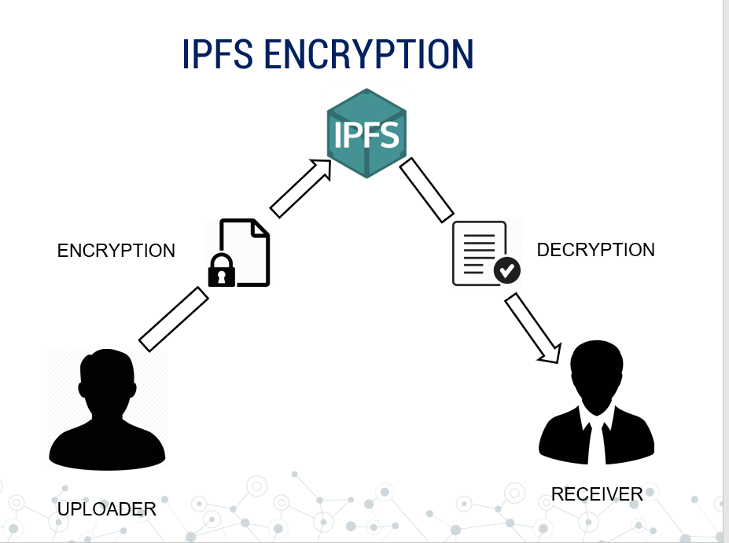
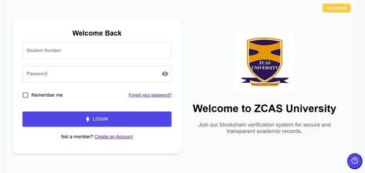
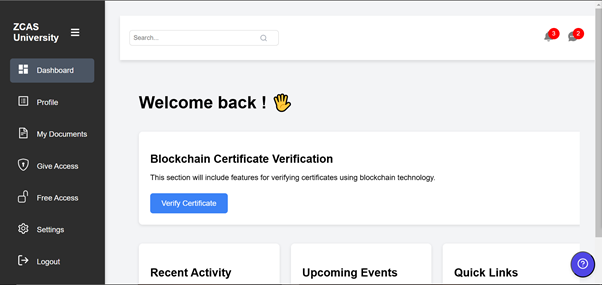
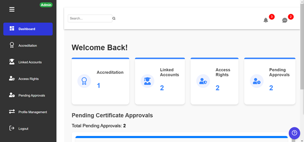

# zcasu_certs
Degree Project

 
         
        

<h1 align="center"> ZCASU_Certs </h1>
<h3 align="center"> Blockchain Based Certificate Verification Web App <h3>
  

  
 
  
   
    
  
   
  
  
 

##  ZCASU_Certs : About
- It is a blockchain based project for online certificate validation. 
- The major problem of counterfeit certificates can be tackled with the help of ZCASU_Certs, as it provides a solution to preserve the       genuineness of a certificate. 
- It works on the idea that: “Only the issuer can upload the certificate and the rest people can only view  it.” The entire process       works on the blockchain in partnership with the IPFS(to provide data security). 
- Does Everything for Certificates : Storing ,Validating and Sharing .
- Thus this is a modern and hassle-free solution to manage certificates and verify them!
- This Project was made at ZCAS University 2024.
## Insight
- It is D-App on [Ethereum](https://www.ethereum.org/).
- Back-End has Smart Contract 
- Front-end of our Web-App is made with [React.Js](https://github.com/facebook/create-react-app) and our complete frontend and backend components are available at   
- All User-Data is stored on [IPFS](https://ipfs.io/) also every data is first encryted locally and then send to ipfs to have more security

 

- All user personal data is stored in mongoDB
- We are using [Metamask](https://metamask.io/) Browser Extension to work with Ethereum.
- We have used [Truffle](https://www.trufflesuite.com/) for testing our project

## How to Use

### Login
- There are two ways to login
  - Login as `Student`
  - Login as `Institute`
  

 

 - Upon First Signup `Metamask` will ask permission to connect your wallet with App.
 
 

 

   
### Dashboard

 #### Student Dashboard
 
 

 

- Student Dashboard have these options :

 - `Dashboard`
   - This is rendered screen after successful authentication and login by the user( Student). The dashaboard displays some tools and relevant information for the user.
     
 - `My Documents`
   - Students can upload their Certificates themselves but these certificates need to be verified by Institute side ,only then                 certificates will appear in my documents section.
 
 - `Give Access`
    - Students can give access to any other institute/organisation to his/her certificates , access is only given for limited time             (24hr)
 
 - `Change Institute` 
    - Students can request change of institute , this request is sent to current institute ,Upon approval students institute is changed. 
   
 #### Institute Dashboard
 
 

 

 
 - Institute Dashboard have these options :
 - `Dashboard`
  - Shows al the statistics such as the pending approvals, access rights given etc...
    
  - `Accredidations`
  - This sections allows the admin to accredidate the user with their certificate
  
 - `Linked Accouts`
   - In this section all student accounts linked to institute are shown.
   - Institute can students certificates from here.
   - Also institute can upload new certificates to students from here.
  
  - `Access Rights`
    - It shows all the student accounts to whom institute has access ,to see their certificates.
  
  - `Pending Approvals`
    - Student requests for certificates approvals appear here .
 
 - `Change Institute Approvals`
   - Student requests for change of institute appear here .
     
 - `Profile Manangement`
   - This section allows the admin to manage the users and information stored in the MongoDB.    
## Installation 

### For Development
 - We are using Truffle for testing and development of this project.
 - Also you need to have Metamask Browser Extension and mongoDB set up.
 - For setting up Truffle (more detailed instruction are avalaible )  
 - Steps :
   - Clone the repo 
   > $ git clone https://github.com/starkster1/zcasu_certs.git
   - Setup Truffle
     - Install truffle globally while in the project directory
     > $ npm install -g truffle
     - Migrate to the smart-contracts folder and initiate truffle
     > $ cd smart-contracts
     > $ init truffle
     
     - Run your local ganache
       
     - Compile and migrate the smart contracts( while in the smart-contracts directory).
     > $ npm compile
     
     > $ npm migrate
     
     - Update the .env with the relavant information such as the Institute Address and the Contract Address collected from the terminal output.
     - Next we move to the backend directory. In this directory we run the backend server.
     > $ node index.js 
     
     - Next, In the frontend directory, we run the React app.
     >// in another terminal (i.e. not in the truffle develop prompt)
     
     > $ cd frontend
     
     > $ npm start
     
  - Open http://localhost:3000 to view it in the browser.       
  - Import Account on Metamask with keys given by Truffle.
  - Testing and Development can be done on these Accounts.
  - Smart contract changes must be manually recompiled and migrated then only it will work.
  -------------------------------------
  ## Contributing
  - We're are open to enhancements & bug-fixes.
  - Feel free to add issues and submit patches.
  ## Authors
  - Jones Mukelabai
## License
This project is licensed under the MIT 
